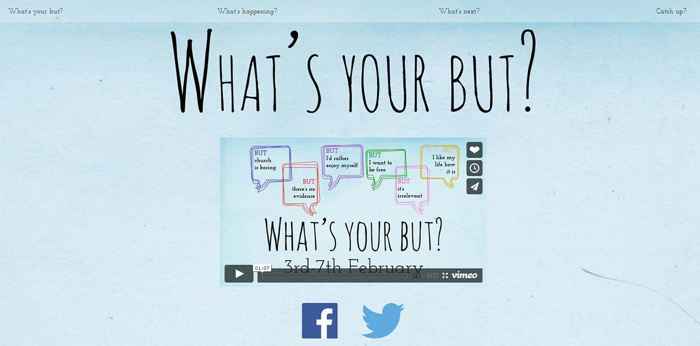
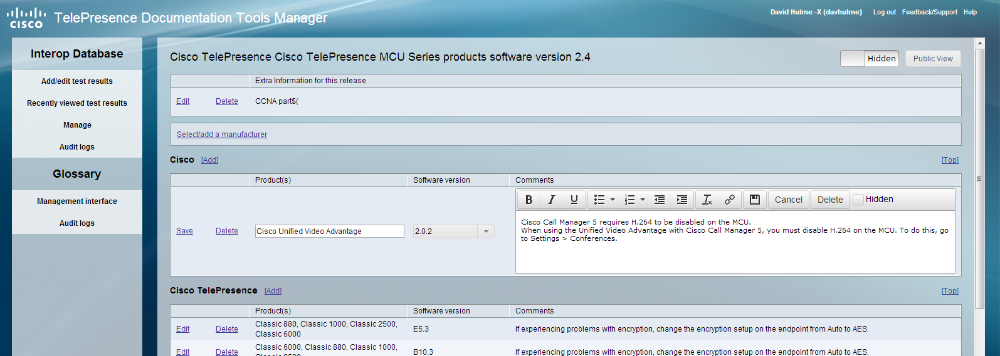
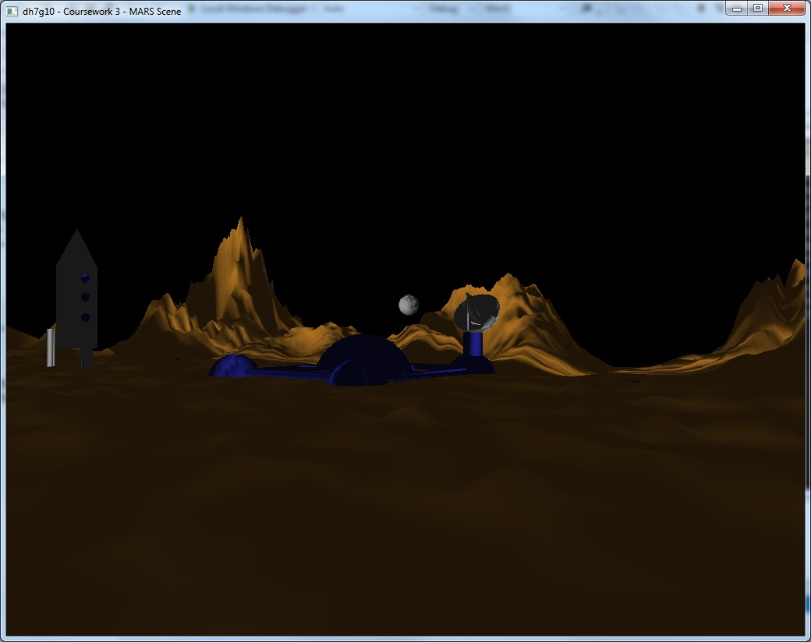
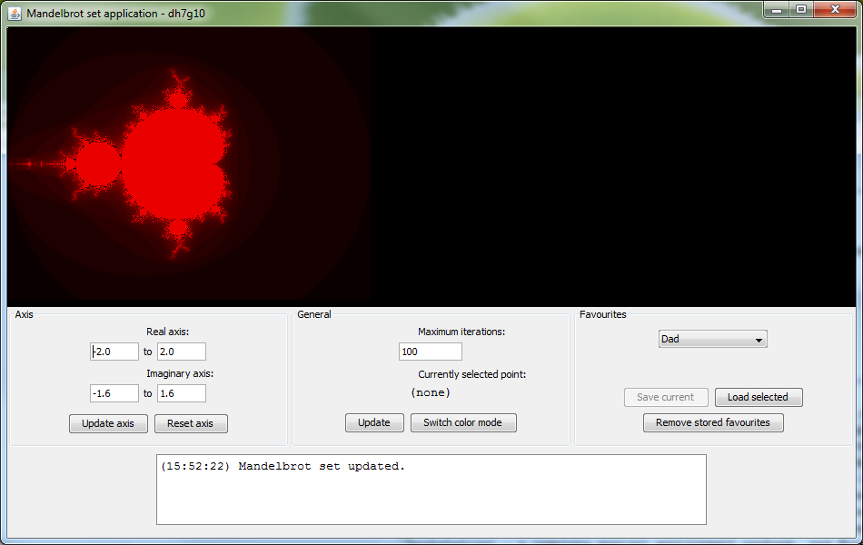
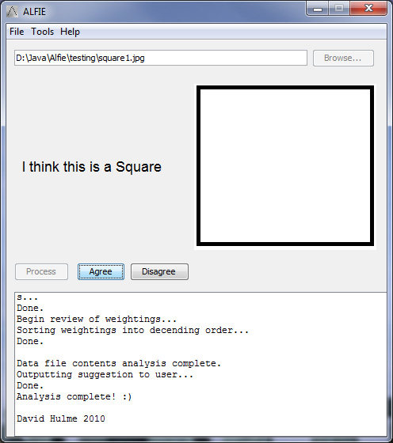

# Multitrack Player
_TODO_

# Keys In-ear Mixes
_TODO_

# Fortnite Highlights
_TODO_

# Next Level Hexagon 2018
_15th April 2018_

Back in March I had the privilge to play keys and be part of the team leading worship at the Next Level youth event in the Hexagon, Reading. Amongst other pre-made tracks, I created a track for 'Tremble', which you can hear in the video below

<iframe width="560" height="315" src="https://www.youtube.com/embed/j6-0Oh2xXOs" frameborder="0" allow="autoplay; encrypted-media" allowfullscreen></iframe>

# Keyboard Tutorials
_2nd January 2018_
With some free time I had over Christmas I've created a couple of tutorials about playing keyboard using Ableton Live. There are also a couple more on my channel, you can find them all in <a href="https://www.youtube.com/playlist?list=PLhYvcekzvgEqyHnvDDR4nNzjLZZubdVaW">this playlist</a>. Hope you find them helpful!
<iframe src="https://www.youtube.com/embed/7nYgXVvY9Po" width="560" height="315" frameborder="0" allowfullscreen="allowfullscreen"></iframe>
<iframe src="https://www.youtube.com/embed/4niWhk4Xwx0" width="560" height="315" frameborder="0" allowfullscreen="allowfullscreen"></iframe>

# Running Keys with Ableton and Windows
_2nd January 2018_

When playing keyboard at live events at my church I use MIDI controllers connected to a Windows laptop (shocking right!) with Ableton and various virtual instrument plugins. Windows does have some advantages over mac, mainly price and customisability, but it is definitely harder to get set up and working reliably. Hopefully in this article you'll find answers to common problems I have experienced.

## Minimum Recommend Specs
- Windows 10 (Microsoft won't be updating 7 or 8 for much longer)
- 8GB RAM or more
- 256GB SSD or more (You can load samples from a hard disk or external drive if necessary)
- Intel Core i5 (preferably i7)
- External USB audio interface

## Troubleshooting
### I get intermittent freezes in ableton or midi controllers stop working.
Check USB cable length, I recommend 3m or less. If you're using a USB hub, make sure it's powered. Replace existing USB cables, sometimes a dodgy wire can cause dropouts. Are your USB connections lose? If so, use a screwdriver to pull the socket prongs out a bit to improve the connection.

Ensure Ableton and your Windows are up to date. Disable 'USB selective suspend setting' under power plan settings. Check you have the correct drivers for your audio interface.

Sometimes there can be differences between using a USB 2 and USB 3 port. USB 3 ports are blue or have 'SS' written with the USB logo. Try changing the type of USB port you are using.

### Windows restarts whilst i'm on stage!
Set your 'active hours' under Windows Update settings.

### I get 'pops' or 'crackles' in my audio!
On low performance machines this could be due to your audio buffer size, try increasing it. Most likely however it is a driver issue. Ensure you have the latest drivers from the audio interface manufacturer for your operating system. If these don't work, contact your audio interface manufacturer, they should be able to provide advice and support. I have had driver problems with Focusrite Scarlett interfaces on Windows 10 machines, but after some driver tweaking everything works reliably.

### Sometimes when playing tracks or virtual instruments, I get audio glitches and ableton freezes briefly.
This is most likely disk problems. If you're using a mechanical hard drive upgrade to a solid state drive. Check what processes are using 'Disk' resources in task manager.

# Metronome App
_17th November 2017_
I&#8217;ve found existing free Metronome apps to cluttered, full of adverts and often have limited functionality. With my recent experience of Vue and Veutify, I decided to make my own. After a couple of evenings, I&#8217;d put something together I was happy with. You can find the app at <a href="http://dhulme.co.uk/metronome">dhulme.co.uk/metronome</a>. Add it to your phone&#8217;s home screen or bookmark it on your web browser. The source code is available on <a href="https://github.com/dhulme/metronome">GitHub</a>, please open an issue if you find any bugs or have any suggestions!

# Money Manager App
_29th September 2017_

For years I&#8217;ve managed my finances in simple Excel spreadsheets. It worked but I was becoming frustrated with the lack of automation. I could have written some macros, but I thought there must be a pre-built soluton out there. I tried several exisiting applications but they were either buggy, didn&#8217;t provide the features I wanted or had an outdated UI. I thought I could try and do better and write an app that would be fully customised to my requirements. The app whould allow users to manage their assets and assign money to different budgets to keep track of spending.

As a JavaScript developer it made sense to use web technologies to achieve this. I used Electron to create a desktop application with the Vue framework. The project is still in early development,<a href="https://github.com/dhulme/money-manager"> but is available on GitHub</a> to clone and try out. Any feedback is welcome!

# Retro Tech
_March 25th 2017_

Back in 2010 I wrote a post about my old Sharp ZQ-770 handhled organiser. In <a href="http://dhulme.co.uk/zq-770/">that post </a>I added a few links to download some programs written for the device as well as the SDK. Recently I was clearing some stuff out from my parent&#8217;s loft and I found the organiser as well as some other retro tech from the early 2000s.

I&#8217;ve been really enjoying the retro tech videos from <a href="https://www.youtube.com/user/Techmoan">Techmoan </a>this year, so inspired by him I put together a YouTube video showing the organisers I owned and telling a bit of their story.

<iframe src="https://www.youtube.com/embed/dwbHdHgQrMY" width="560" height="315" frameborder="0" allowfullscreen="allowfullscreen"></iframe>

# O Come All Ye Faithful Backing Track
_16th January 2017_

As part of our Christmas Day meeting at Kerith Community Church, I produced a backing track in Ableton based on Bethel Kids&#8217; version of &#8216;O Come All Ye Faithful&#8217;. Most sounds featured on the track are from Spectrasonics Omnisphere, with some additional sounds from Native Instruments libraries.

You can listen to the track below, or as part of the worship set <a href="https://www.youtube.com/watch?v=k3I-i0gAKas">here</a>.

<iframe width="560" height="315" src="https://www.youtube.com/embed/N9xIwtExQ-g" frameborder="0" allowfullscreen></iframe>

# Vlogs
_15th October 2016_

This year my wife and I have started watching daily vlogs by <a href="https://www.youtube.com/channel/UCnEn0EUV13IR-_TK7fiIp3g">Alfie Deyes/Pointless Blog</a>. This inspired us to make some lighthearted vlogs of everyday life picking up on some of the classic phrases and things that happen in Alfie&#8217;s vlogs.

<iframe width="560" height="315" src="https://www.youtube.com/embed/Lvie4pTut64" frameborder="0" allowfullscreen></iframe>

<iframe width="560" height="315" src="https://www.youtube.com/embed/K64dJ_lKNnE" frameborder="0" allowfullscreen></iframe>
  

# Church Worship Backgrounds
_29th November 2015_

As part of my volunteering at <a href="http://kerith.co.uk">Kerith Community Church</a>, I have produced some motion backgrounds in Adobe After Effects for use during Sunday meetings. Feel free to use these in your own churches and meetings, and drop me an email &#8211; it would be great to hear how these are being used.

Click <a href="https://www.youtube.com/playlist?list=PLhYvcekzvgEoy-pHanGKAtgD4skJDGqIp">here</a> preview them on YouTube.

# Stopwatch Web App
_1st July 2014_

Whilst preparing for several presentations at the end of my degree, I was frustrated with the lack of a good web-based stopwatch application. I therefore spent some time developing my own in JavaScript! You can find it at <a href="/stopwatch">dhulme.co.uk/stopwatch</a>.

# Minecraft Parody Videos
_1st July 2014_

With the help of two of my friends from Southampton, Dom and Jeremy, I produced several Minecraft videos, parodying the &#8216;Let&#8217;s play&#8217; genre. As I have now left Southampton, I will no longer be making any of these videos :(. I have embedded what I feel is the funniest video below. I will miss making these!

<iframe width="560" height="315" src="//www.youtube.com/embed/xv9balC7ZcA" frameborder="0" allowfullscreen></iframe>

# Multimedia and the Semantic Web &#8211; Conference paper
_1st July 2014_

One of my fourth year degree modules looked at a variety of topics relating to the Semantic Web. I wrote a short conference proceedings investigating the use of multimedia within the Semantic Web. You can read the abstract below and the paper <a href="/files/multimedia-and-the-semantic-web.pdf">here</a>.

With the advent of Web 2.0 and user-generated content, the amount of multimedia on the Web is growing. This vast amount of data, coupled with its rich nature, make it challenging to bring to the Semantic Web. This paper researches the process of making multimedia data accessible to the Semantic Web and applications that could become possible.

# Viability of HTML5 Video &#8211; Individual Research Project
_1st July 2014_

For my fourth year individual research project I investigated the viability of HTML5 video as a method of delivering video content to users. You can read the abstract below and the paper <a href="https://dl.dropboxusercontent.com/u/15460305/dhulme.co.uk/irp.pdf">here</a>.

> HTML5 defines a method for videos to be embedded directly into a web page. The ability to directly embed videos into web pages removes the web browser&#8217;s dependence on third party software and opens up new possibilities for the integration of video multimedia with other web content.

However, for any new web technology to gain acceptance it must be comparable to the current technology in use. In this paper, an examination of the viability of HTML5 video as a replacement for the current plug-in based technologies in use is conducted, as well as research into the new opportunities it can provide.

# Compare That Car &#8211; Group Project
_1st July 2014_

In a fourth year module, Rich Internet Applications, we were asked to produce an application in groups that used open data to satisfy a consumer need.

We focused on the UK new and used car market, where it is currently difficult to compare cars based on their reliability. We used factual data such as theft rate, MOT pass rate and recall rates to help users discover the most reliable cars.

# Synote Second Screening &#8211; Group Design Project
_23rd February 2014_

As part of a group I helped to develop a web application for a real world client. We developed Synote Second screening. The system allows users to add collaborative annotations to a video in real-time through a second screen experience. You can see a video demo of the system <a href="https://www.youtube.com/watch?v=sozWk-vvW-A&#038;feature=youtu.be">here</a>.

We developed the system using Node.js with the intention for our system to be integrated with an existing system at a later date, thus good design was essential.

# Easy Design &#8211; Web Application
_23rd February 2014_

A fourth year module tasked me to develop an enterprise web site. I developed Easy Design &#8211; a service designed to help customers such as charities and organisations to quickly produce well designed logos, posters and flyers based on user generated content. A prototype application was produced in Ruby on Rails to show the main functionality of the site: uploading content, discovering content, downloading content, reviewing content and system management. The video clip below shows the site in action.

<iframe width="560" height="315" src="//www.youtube.com/embed/4flt9zCDOCc?rel=0" frameborder="0" allowfullscreen></iframe>

# Events Week Website and Video &#8211; Southampton CU
_15th February 2014_

Each year Southampton CU runs a week of events in February. To promote the week I produced a website and accompanying in promotional video.

A slight parallax effect and embedded fonts were some of the new techniques I used when producing the site. 

You can view the website and watch the video <a href="http://dhulme.co.uk/southampton-cu-events-week/">here</a>.

# Cisco &#8211; Kit list
_13th September 2013_
The Cisco Kit list was an extension project I took on after finishing the TDTM. I chose to develop the project using <a title="Node.js" href="http://nodejs.org/">Node.js</a>, a web technology with which I was unfamiliar, but interested in. The project was a great success, and I was able to see it being used by the team before the completion of my internship.

Users of the Kit list could add TelePresence devices to the system using an IP address. Detailed information about the device would then be fetched using system.xml (a public XML file available on the device), and <a href="http://xmlrpc.scripting.com/default.html">XML RPC</a> calls. Using this information, users could book a specific device for a set amount of time.

The Kit list also provided information about the last log in to the device. This feature was provided using <a href="http://en.wikipedia.org/wiki/Syslog">Syslog</a>, as such information was not available by RPC.

# Cisco &#8211; TelePrescence Tools Management Database
_12th September 2013_

Over the summer of 2013 I had the opportunity to work as a web developer intern at Cisco. The focus of the internship was improving their TelePresence tools management database, an existing product written in PHP, with a public facing website and a private editing interface.

I fixed bugs in the system, implemented extra features and provided a UI overhaul. In addition, I added a TelePresence glossary (shown below), with a private editing interface allowing for the editing and previewing of entries.

To see the public interface on cisco.com, click <a href="https://tp-tools-web01.cisco.com/start/">here</a>.

# Freshers&#8217; week website &#8211; Southampton CU
_11th September 2013_

I produced a Freshers&#8217; week website for Southampton University Christian Union. The design and theme was based around existing design work I had produced for the week.

All the CSS, layouts and images were custom produced. I took inspiration from the new &#8216;scrolling&#8217; style of website that developers are using. You can view the website <a href="http://dhulme.co.uk/southampton-cu-freshers/">here</a>.

# Sisrom &#8211; Third Year Project
_28th July 2013_

Part of Year 3 of my Computer Science degree was an individual project. I produced a smart remote image monitoring system running on a small, single board computer: the <a href="http://www.raspberrypi.org">Raspberry Pi</a>. Webcams were connected to the Raspberry Pi and pointed at different areas within a home and images from these webcams could be seen through a web interface.

Areas in these images could be selected and monitored for certain visual changes such as intensity or colour. If any changes were detected in these areas, the system would generate a notification. This allowed the user to monitor the state of different objects within their home.

The web interface was written using the <a href="http://www.djangoproject.com">Python Django web framework</a>, as well as client side scripting in HTML/CSS and JavaScript with jQuery.

# Mars Scene
_10th March 2013_

As part of a 3rd year module &#8220;Principles of Computer Graphics&#8221;, we had to create a 3D scene in C++ and OpenGL with a &#8216;Mars&#8217; theme. We had to create our own models, shaders and rendering code, to combine the different objects in a single scene. An automatic fly-through tour of the environment was also required.

# Southampton Christian Union Media
_9th February 2013_
Over the past year I&#8217;ve had the opportunity to become  more involved with media production at <a title="SUCU" href="http://sucu.org.uk/">Southampton University Christian Union</a>. As well as gaining better understanding of Adobe&#8217;s Creative Suite, I&#8217;ve been able to collaborate on several projects with my great friend <a href="http://davebetts.org.uk">Dave Betts</a> composing the accompanying music to the videos.

One of these collaborative projects was a video to promote a week of events put on by the CU entitled &#8216;Uncover&#8217;. The events week video was interesting to work on as it built upon existing ideas from <a title="UCCF" href="http://uccf.org.uk">UCCF</a>, I was able to use their original footage, and add elements to created a promo video suitable for our specific events week.

I&#8217;ve also recently produced a promotional video for <a title="Alpha" href="http://alpha.org">Alpha</a>. Creating this was entirely different  with the inspiration coming from a <a href="http://vimeo.com/25227351">video</a> produced for <a title="Kerith" href="http://kerith.co.uk">Kerith Community Church</a> a while ago. I used the same music, and produced something with a similar style and theme.

<iframe src="http://www.youtube.com/embed/yoQij3_ELMc" frameborder="0" width="560" height="315"></iframe>

<iframe src="http://www.youtube.com/embed/0jQs0mJO-uY" frameborder="0" width="560" height="315"></iframe>

# CodeTeachr
_7th February 2013_

Last Semester, as part of a group coursework, we had to produce a web application using the <a href="https://developers.google.com/appengine/">Google App Engine</a>. The application could do anything we wanted, the only constraint being that we had to use Python for server-side scripting, and JavaScript for the client side. Our group chose to produce an learning tool to teach First Year Computer Scientists Java programming.

It was a great project to work on, and I really enjoyed the process of learning JavaScript and <a href="http://www.djangoproject.com">Python Django</a>, as well as playing some more with with HTML/CSS.

# Events Week Video
_30th January 2012_

Back before Christmas, I was asked (with my friend Dom) to design and produce a promotional video for the Southampton University Christian Union upcoming Events Week in February 2012. There was not much of a brief to go by, so we took some inspiration from a Willow Creek video advertising the Leadership Summit 2011 (watch this <a title="Leadership Summit 2011" href="http://www.youtube.com/watch?v=XHuRDArYi14">here</a>).

I then brought together some initial concept ideas for the video in Adobe Premiere &#8211; including text, images and backgrounds from various free sources (such as <a title="Worship Backgrounds" href="http://www.worship-backgrounds.com/">this one</a>). The idea was to have some sort of storyboard of ideas that could then be developed further into the final video.

To do this I used Adobe After Effects CS 5.5, which I spent a couple of hours learning through their tutorials as well as using tutorials on YouTube of how to achieve certain effects (such as typing). One issue was that we were constrained by using trails of the program &#8211; in total we got through three trail periods on three different computers!

After multiple revisions and the addition of a Hillsong backing track (With Everything), which Dom had chopped to the right length and added extra instruments and effects in Garage Band, we had the final video produced (see below).

This was a great project to work on as I gained my first experience of creating a video in After Effects, as well as learning to listen to a lot of different criticism from many people, and sifting through to choose the comments I wanted to take on board.

<iframe src="http://www.youtube.com/embed/3zSQfl4hIf8" frameborder="0" width="640" height="360"></iframe>

# Roland RD-700NX
_23rd June 2011_

Recently I purchased a Roland RD-700NX Digital Stage Piano. You can watch a video review of the keyboard <a href="http://www.youtube.com/watch?v=zSixsdNRiPA">here</a>. Below are links to various pictures of the keyboard to give you a better idea of how it looks.

# Mandelbrot Set Application
_12th April 2011_

For a section of my first year programming coursework, we were asked to create an application to draw fractals based on the<a href="http://en.wikipedia.org/wiki/Mandelbrot_set">Mandelbrot</a> and <a href="http://en.wikipedia.org/wiki/Julia_set">Julia</a> sets. You can download a jar file of the final product <a href="http://www.box.net/shared/af74do5u69">here</a>. If you have any questions, or want access to the source code, mail me at <a href="mailto:dh7g10@soton.ac.uk">dh7g10@soton.ac.uk</a>.

# ALFIE
_9th September 2010_

For the programming project part of my A Level Computing course, I was given the task of desiging a project that could be used as a learning tool. I chose to create an application that would teach machine learning through a demonstration. The user would be able to provide the computer with simple images of shapes, and over time the comptuer would begin to learn and recognise simple shapes, based on the number and size of the angles, length of sides etc.

If you would like to see ALFIE in action, you can do so by downloading the application <a href="http://www.box.net/shared/yg7u0uy4v6">here</a> as an EXE extactor, or you can download a zip of the files <a href="http://www.box.net/shared/7ouud45n34">here</a> if you are on Unix. And if you would like to understand the image detection process that ALFIE goes through each time is processed, you can download/view a PDF <a href="http://www.box.net/shared/u4kbxl5son">here</a>.

# ZQ-770
_9th September 2010_

The ZQ-770 is a PDA that was manufactured by Sharp during the 2000&#8217;s. While it is not a powerful machine, it perhaps paved some of the way for modern day smartphones such as the iPhone and Android devices, with its expansive SDK (Standard development kit) and ability to write applications in C, Basic and Z80 assembler it allowed for powerful programs to be written by developers and downloaded onto the device.

I invested a lot of time at one stage writing applications for the device, and even publishing them on the website: MyWizard.com. My ZQ-770 is now safely stored in the loft, although I managed to get hold of an emulator for the device which allows you download and run the .wzd files avaliable from MyWizard.com. You can download the emulator <a href="http://www.box.net/shared/h21xhu7qds">here</a>, you can download a section of my favourite applications in a zip file <a href="http://www.box.net/shared/i18mq56rhy">here</a> and you can even download the C SDK <a href="http://www.box.net/shared/30xjyfbr5i">here</a>. Enjoy!