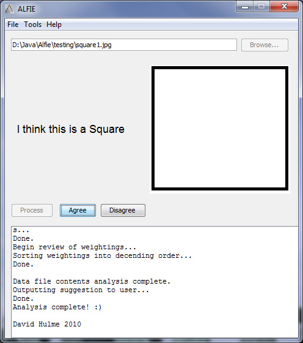

<BlogPostHeader />

For the programming project part of my A Level Computing course, I was given the task of designing a project that could be used as a learning tool. I chose to create an application that would teach machine learning through a demonstration. The user would be able to provide the computer with simple images of shapes, and over time the computer would begin to learn and recognise simple shapes, based on the number and size of the angles, length of sides etc.

If you would like to see ALFIE in action, you can do so by downloading the application <a href="http://www.box.net/shared/yg7u0uy4v6">here</a> as an EXE extactor, or you can download a zip of the files <a href="http://www.box.net/shared/7ouud45n34">here</a> if you are on Unix. And if you would like to understand the image detection process that ALFIE goes through each time is processed, you can download/view a PDF <a href="http://www.box.net/shared/u4kbxl5son">here</a>.

