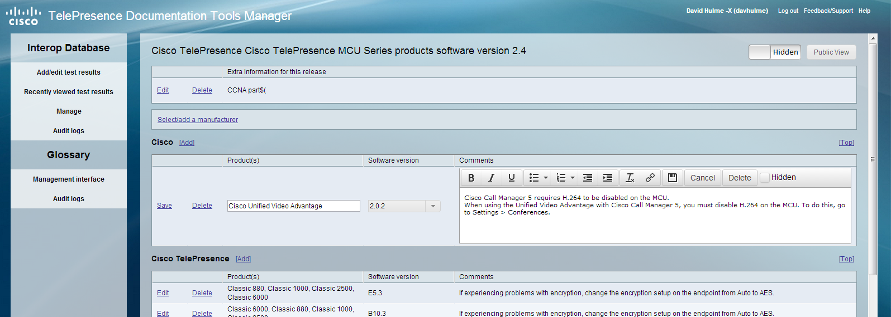
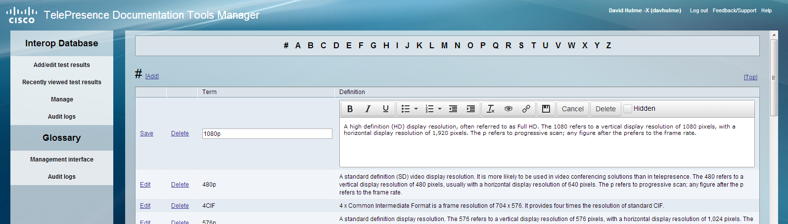

<BlogPostHeader />

Over the summer of 2013 I had the opportunity to work as a web developer intern at Cisco. The focus of the internship was improving their TelePresence tools management database, an existing product written in PHP, with a public facing website and a private editing interface.

I fixed bugs in the system, implemented extra features and provided a UI overhaul. In addition, I added a TelePresence glossary (shown below), with a private editing interface allowing for the editing and previewing of entries.

To see the public interface on cisco.com, click <a href="https://tp-tools-web01.cisco.com/start/">here</a>.

