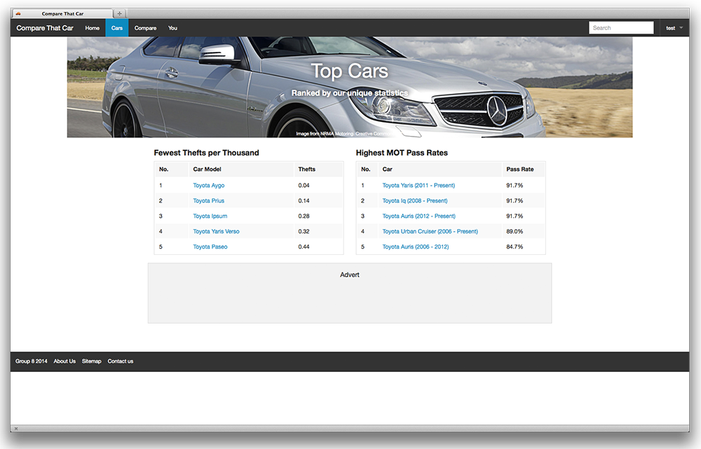

<BlogPostHeader />

In a fourth year module, Rich Internet Applications, we were asked to produce an application in groups that used open data to satisfy a consumer need.

We focused on the UK new and used car market, where it is currently difficult to compare cars based on their reliability. We used factual data such as theft rate, MOT pass rate and recall rates to help users discover the most reliable cars.

