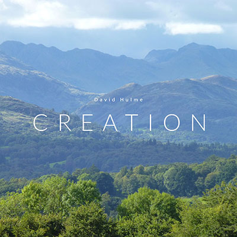

<BlogPostHeader />

I'm excited to announce the release of my first ever album! Creation is a 10 track instrumental album, inspired by creation, that I’ve written this year. You can listen now on [Spotify](https://open.spotify.com/album/2MOrrG75q2iVrVrZVIXLYk?si=vIgTpmSRQ52uE_VA7F8ljA) and [YouTube](https://www.youtube.com/playlist?list=PLhYvcekzvgErO2-bcHD5sdGNLzkgLR4PM)!  I've also uploaded a [behind the scenes video](https://youtu.be/3VBa0wAlunY) where I talk about the production of each track. It has always been a dream of mine to release my own music, and despite this year being hard, it’s given me more time to invest in this and I’m so happy to share it with you. I’m grateful to God for the time, money and ability he has given me, and I’m thankful for everyone who has given me inspiration, advice and feedback in this process.

