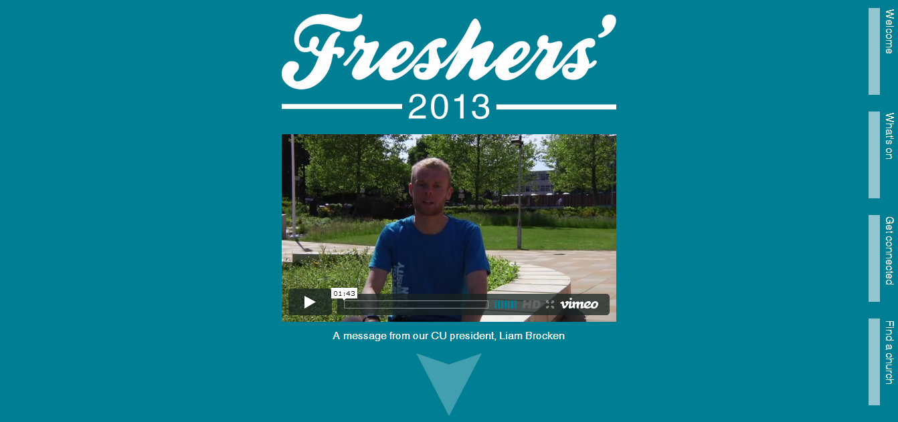

<BlogPostHeader />

I produced a Freshers&#8217; week website for Southampton University Christian Union. The design and theme was based around existing design work I had produced for the week.

All the CSS, layouts and images were custom produced. I took inspiration from the new &#8216;scrolling&#8217; style of website that developers are using. You can view the website <a href="http://dhulme.co.uk/southampton-cu-freshers/">here</a>.

