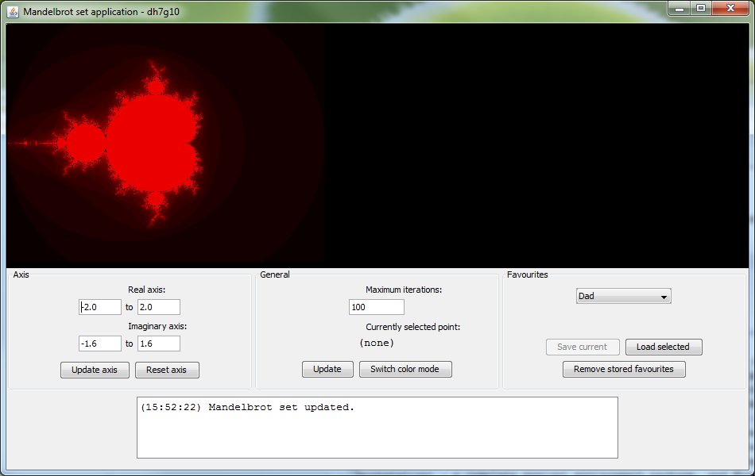

<BlogPostHeader />

For a section of my first year programming coursework, we were asked to create an application to draw fractals based on the<a href="http://en.wikipedia.org/wiki/Mandelbrot_set">Mandelbrot</a> and <a href="http://en.wikipedia.org/wiki/Julia_set">Julia</a> sets. You can download a jar file of the final product <a href="http://www.box.net/shared/af74do5u69">here</a>. If you have any questions, or want access to the source code, mail me at <a href="mailto:dh7g10@soton.ac.uk">dh7g10@soton.ac.uk</a>.

