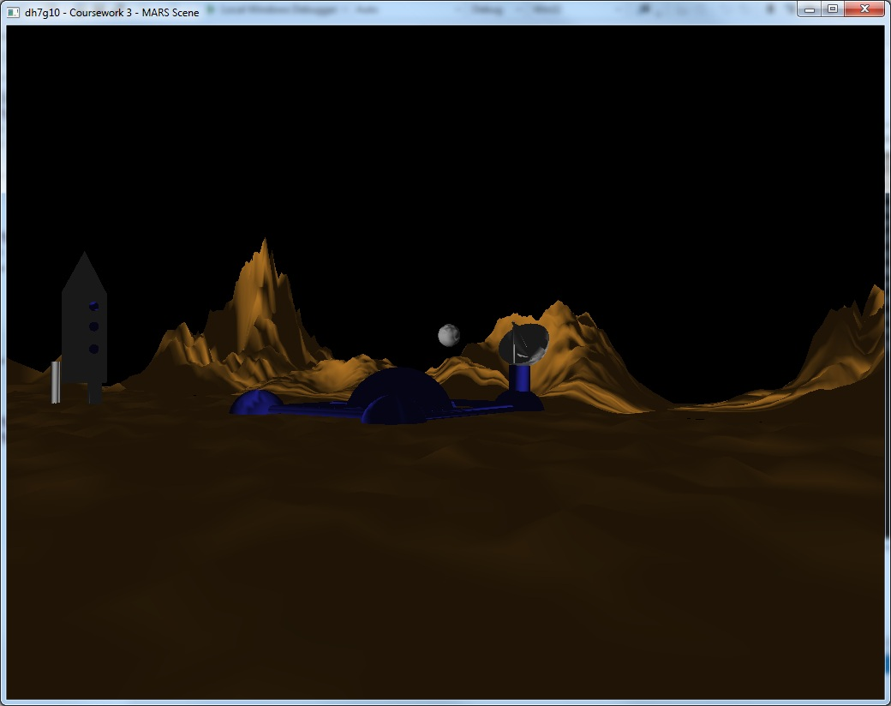

<BlogPostHeader />

As part of a 3rd year module "Principles of Computer Graphics", we had to create a 3D scene in C++ and OpenGL with a &#8216;Mars&#8217; theme. We had to create our own models, shaders and rendering code, to combine the different objects in a single scene. An automatic fly-through tour of the environment was also required.

