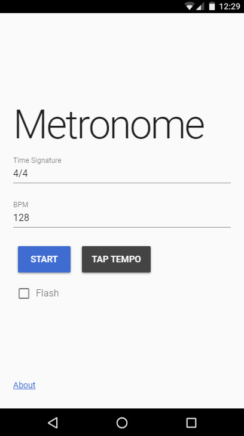

<BlogPostHeader />

I&#8217;ve found existing free Metronome apps to cluttered, full of adverts and often have limited functionality. With my recent experience of Vue and Veutify, I decided to make my own. After a couple of evenings, I&#8217;d put something together I was happy with. You can find the app at <a href="https://dhulme.uk/metronome">dhulme.uk/metronome</a>. Add it to your phone&#8217;s home screen or bookmark it on your web browser. The source code is available on <a href="https://github.com/dhulme/metronome">GitHub</a>, please open an issue if you find any bugs or have any suggestions!

