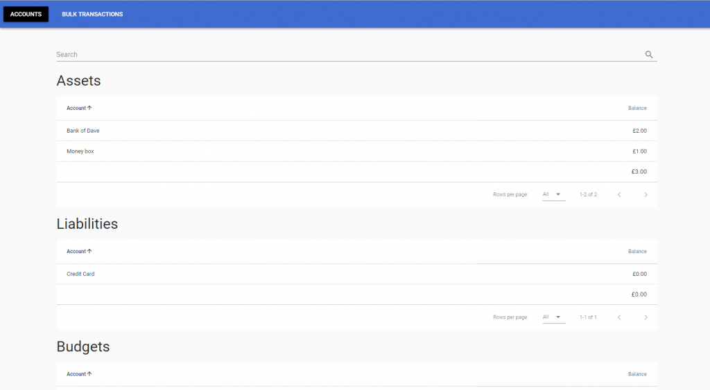

<BlogPostHeader />

For years I've managed my finances in simple Excel spreadsheets. It worked but I was becoming frustrated with the lack of automation. I could have written some macros, but I thought there must be a pre-built solution out there. I tried several existing applications but they were either buggy, didn't provide the features I wanted or had an outdated UI. I thought I could try and do better and write an app that would be fully customised to my requirements. The app would allow users to manage their assets and assign money to different budgets to keep track of spending.

As a JavaScript developer it made sense to use web technologies to achieve this. I used Electron to create a desktop application with the Vue framework. The project is still in early development,<a href="https://github.com/dhulme/money-manager"> but is available on GitHub</a> to clone and try out. Any feedback is welcome!

