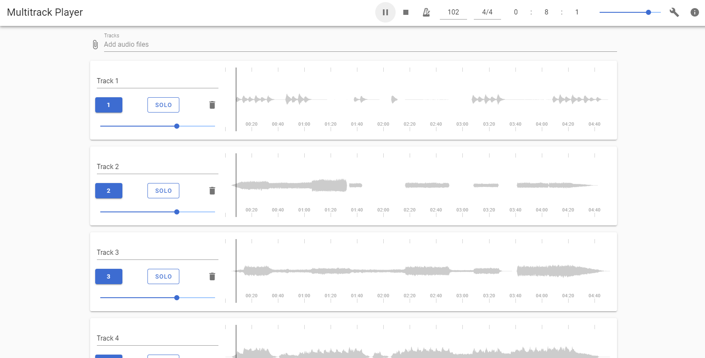

<BlogPostHeader />

Running backing tracks at Church is something I do every week. But I've realised using Ableton is quite complicated for new people to use and often not needed for running a single track. I had the idea of creating a multitrack player to run in the web browser to use in both rehearsals or live, on phone, tablet or laptop. This is the first test release that allows you add multiple tracks and a click. You can find the demo [here](https://dhulme.uk/multitrack-player) and the source code on [GitHub](https://github.com/dhulme/multitrack-player). If anyone would find this useful and has any bugs, feedback, feature requests or would like to get involved, please let me know!

