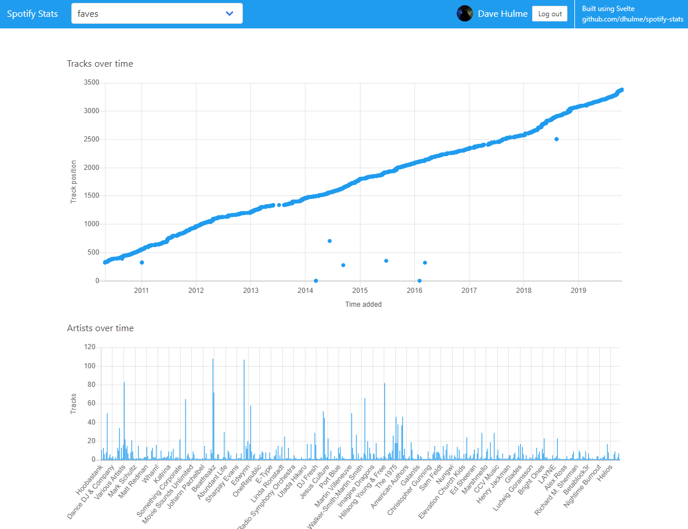

<BlogPostHeader />

Back in early 2018 I made a simple web app in Vue for viewing statistics about my Spotify playlists. It was more a proof of concept, and I never properly finished or released it. Fast forward to last week and I started reading about a new(ish) framework called [Svelte](https://svelte.dev). It differs from React and Vue in that it doesn't use a virtual DOM, and instead compiles your code to lower level JavaScript that interacts with the DOM directly. A [great talk from the creator](https://www.youtube.com/watch?v=AdNJ3fydeao) explains how this is beneficial as the amount of nodes your app is rendering increases.

I thought rebuilding the Spotify stats app in Svelte would be a good opportunity to learn the framework and get the app to a nice polished state. I went with the [Bulma](https://bulma.io/) CSS-only framework to keep things simple, and because there aren't many component frameworks built for Svelte.

You can check out the app for yourself at [dhulme.uk/spotify-stats](https://dhulme.uk/spotify-stats).

